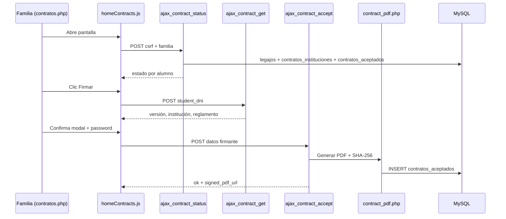

# NATTA App — Mapa frontend / backend

Referencia rápida: qué archivo PHP carga qué JS, qué AJAX consume y cómo encaja el módulo de contratos.

**Guías ampliadas:** `guia-tecnica-devs.md` · `guia-funcional-admin.md`

---

## 1) Visión general

```text
Vista PHP (HTML + page-data)
        ↓
frontend/js/index.js  (data-page → pages/*Page.js)
        ↓
fetch → backend/ajax/*.php  (+ php/* para auth)
        ↓
MySQL + storage/contratos_firmados/
```

---

## 2) Estructura de carpetas (resumida)

```text
natta-app/
├─ index.php, home.php, contratos.php, …
├─ contrato_documento.php
├─ contrato_documento_firmado.php
├─ frontend/js/
│  ├─ index.js
│  ├─ config/apiEndpoints.js
│  ├─ core/
│  ├─ ui/
│  └─ pages/
│     ├─ homePage.js
│     ├─ contratosPage.js
│     └─ homeContracts.js      ← lógica compartida contratos
├─ backend/
│  ├─ bootstrap.php
│  ├─ ajax/
│  └─ lib/
│     ├─ contract_institution.php
│     ├─ contract_render.php
│     └─ contract_pdf.php
├─ docs/contratos/             ← plantillas HTML (no DB)
├─ storage/contratos_firmados/ ← PDF firmados
├─ estados_de_cuenta/          ← secretaría / informes admin
├─ php/                        ← login, passwords
└─ config/
```

---

## 3) Páginas dashboard → módulos JS

| Vista PHP | `data-page` | Módulo JS | Notas |
|-----------|-------------|-----------|-------|
| `home.php` | `home` | `homePage.js` | Estado cuenta + contratos en home |
| `contratos.php` | `contratos` | `contratosPage.js` | Firma y estado contrato |
| `info-importante.php` | `info-importante` | `infoImportantePage.js` | Comunicados |
| `instituciones.php` | `info-importante` | `infoImportantePage.js` | Contactos |
| `agregaremail.php` | `agregar-email` | `agregarEmailPage.js` | Emails |
| `talondepago.php` | `talon-de-pago` | `talonDePagoPage.js` | Talones |
| `librodesugerencias.php` | `libro-sugerencias` | `libroSugerenciasPage.js` | Sugerencias |
| `informarerror.php` | `informar-error` | `informarErrorPage.js` | Errores |

Todas usan `notificationsPanel.js`. La mayoría inicializa `paymentModal.js`.

---

## 4) Endpoints AJAX

Definidos en `frontend/js/config/apiEndpoints.js`.

### Cuenta y pagos

| Endpoint | Método | Uso |
|----------|--------|-----|
| `ajax_cuotas.php` | POST | Cuotas para modal de pagos |
| `ajax_historial.php` | POST | Historial HTML por legajo |
| `ajax_solicitar_talon.php` | POST | Solicitar talones |
| `ajax_cancelar_solicitudes.php` | POST | Cancelar talones |
| `ajax_agregar_email.php` | POST | Solicitar email |
| `ajax_cancelar_solicitud_email.php` | POST | Cancelar solicitud email |

### Notificaciones

| Endpoint | Uso |
|----------|-----|
| `ajax_notificaciones.php` | Listado |
| `ajax_notificaciones_leer.php` | Marcar leídas |

### Contratos

| Endpoint | Uso | Respuesta clave |
|----------|-----|-----------------|
| `ajax_contract_status.php` | Estado por alumno del grupo | `status[]`: `signed`, `admin_aprobado`, `estado_flujo` |
| `ajax_contract_get.php` | Datos modal firma | `contract.contract_version`, `institucion_contrato` |
| `ajax_contract_accept.php` | Registrar firma | Genera PDF + inserta `contratos_aceptados` |

### Vistas contrato (no AJAX)

| URL | Función |
|-----|---------|
| `contrato_documento.php` | HTML personalizado (lectura) |
| `contrato_documento_firmado.php` | Descarga PDF firmado |

Constantes JS: `CONTRATO_DOCUMENTO_URL`, `CONTRATO_DOCUMENTO_FIRMADO_URL`.

---

## 5) Módulo contratos — mapa de archivos

```text
Familia (contratos.php / home)
    │
    ├─► homeContracts.js
    │       ├─► ajax_contract_status.php
    │       ├─► ajax_contract_get.php
    │       └─► ajax_contract_accept.php
    │
    ├─► contrato_documento.php
    │       └─► contract_render.php + docs/contratos/*.html
    │
    └─► contrato_documento_firmado.php
            └─► storage/contratos_firmados/

ajax_contract_accept.php
    └─► contract_pdf.php → Dompdf → storage + SHA-256
    └─► contract_institution.php → contratos_instituciones
```

### Base de datos (contratos)

| Tabla | Rol |
|-------|-----|
| **`contratos_instituciones`** | Config por colegio: directivo, ciclo (`contract_anio`, `contract_revision`), `contrato_activo`, `accepted_text` |
| **`contratos_aceptados`** | Firma por alumno + versión; SHA; ruta PDF; `admin_aprobado` |
| ~~`contracts`~~ | **Eliminada** (jun 2026) |

Plantillas: `docs/contratos/Contrato_{INST}_{AÑO}_{REV}.html`  
Código institución = últimas 2 letras del curso (`ET` → archivo `IDET`).

---

## 6) Flujo: firma de contrato



---

## 7) Flujos clásicos (no contratos)

### Estado de cuenta

`home.php` → `ajax_historial.php` + `ajax_cuotas.php` (modal pagos).

### Talones

`talondepago.php` → `ajax_solicitar_talon.php` / `ajax_cancelar_solicitudes.php`.

### Auth

| UI | Proceso |
|----|---------|
| `php/login_padre.php` | Login |
| `php/primer_ingreso.php` … | Alta clave |
| `php/olvide_password.php` … | Reset email |

---

## 8) Backend admin / secretaría

| Archivo | Uso |
|---------|-----|
| `estados_de_cuenta/secretaria_documentacion.php` | Documentación y contratos por alumno |
| `estados_de_cuenta/informacion_general.php` | KPIs; contratos activos por `contratos_instituciones` |

---

## 9) Configuración

| Archivo | Contenido |
|---------|-----------|
| `config/db.php` | Conexión MySQL |
| `config/app.php` | `APP_PUBLIC_URL` (enlaces email/PDF) |
| `config/smtp.php` | Mail confirmación contrato |
| `backend/bootstrap.php` | Sesión, autoload, helpers |

---

## 10) Checklist: nueva página dashboard

1. Vista PHP + `data-page`.
2. `pages/nuevaPage.js` → `initNuevaPage`.
3. Registro en `index.js`.
4. `page-data` si aplica.
5. Endpoint + `apiEndpoints.js`.
6. Probar notificaciones y consola.

---

## 11) SQL de referencia

| Archivo | Cuándo usar |
|---------|-------------|
| `docs/sql/u207063327_contactos_db.sql` | Esquema completo actual (sin `contracts`) |
| `docs/sql/contratos_unificar_instituciones.sql` | Migración desde DB antigua (one-shot) |

---

*Última actualización: junio 2026.*
